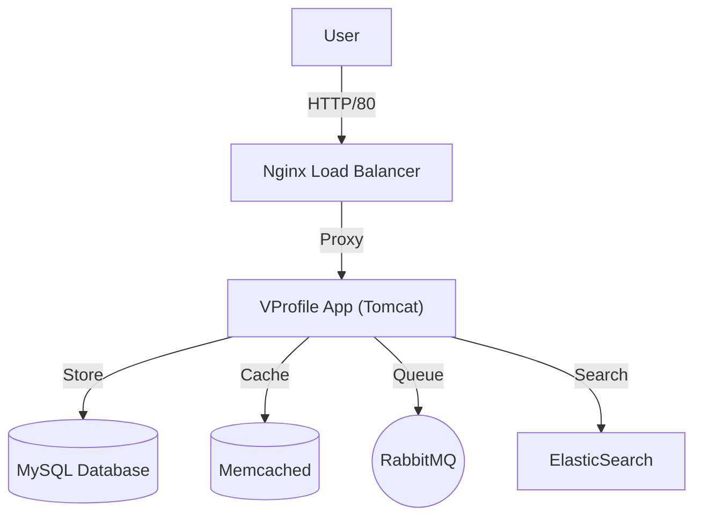

# VProfile - Kubernetes Deployment

> **Comprehensive DevOps Checklist for VProfile App**
> A multi-tier Java web application demonstrating a complete DevOps lifecycle from containerization to production-grade orchestration.

## 🏗️ Architecture

This project implements a microservices-style architecture composed of the following components:



### 🧩 Services Breakdown

- **Nginx**: Acts as an ingress/load balancer for the application.
- **Tomcat (App)**: Hosts the VProfile Java web application artifact.
- **MySQL**: Relational database for persistent user data.
- **Memcached**: In-memory key-value store for database coaching.
- **RabbitMQ**: Message broker for asynchronous processing.
- **ElasticSearch**: Search engine for application data.

## ⚙️ Prerequisites

Before starting, ensure you have the following tools installed:

- **Docker & Docker Compose**: For local testing.
- **Kubernetes Cluster** (Minikube, EKS, or Kubeadm): For production deployment.
- **Java 11 & Maven 3**: If you intend to build the source code manually.

## 🚀 Getting Started

### Option 1: Local Development (Docker Compose)

Use Docker Compose to bring up the entire stack locally for testing.

```bash
cd Docker-files/
docker-compose up -d
```

Access the application at `http://localhost`.

### Option 2: Kubernetes Deployment

Deploy the application to a Kubernetes cluster.

1. **Clone the repository:**

    ```bash
    git clone -b kubernetes https://github.com/Ammar-Abdelhady-ai/KubeDock.git
    cd KubeDock
    ```

2. **Create Namespace (Optional but recommended):**

    ```bash
    kubectl create namespace vprofile
    kubectl config set-context --current --namespace=vprofile
    ```

3. **Apply Manifests:**
    The manifests are located in the project root. Apply them in order or all at once.

    ```bash
    kubectl apply -f .
    ```

4. **Verify Deployment:**

    ```bash
    kubectl get pods
    kubectl get svc
    ```

    Wait for all pods to be in `Running` state and Services to be allocated IPs/LoadBalancers.

## 🛠️ Build Process (CI/CD)

The project includes a `Jenkinsfile` for automated pipelines.

1. **Build**: `mvn clean install`
2. **Test**: Unit & Integration tests.
3. **Analysis**: Checkstyle & SonarQube.
4. **Artifact**: Push WAR file to Nexus Repository.

## 📂 Project Structure

- **`/src`**: Java source code.
- **`/Docker-files`**: Dockerfiles for each service (App, Web, DB).
- **`/ansible`**: Playbooks for provisioning Kubeadm cluster.
- **`/vagrant`**: Vagrantfiles for local VM setup.
- **`*.yml`** (Root): Kubernetes manifest files.

## 👤 Author

**Ammar Abdelhady**
*DevOps Engineer*
